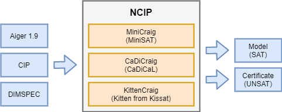

# Next Craig Interpolant Prover

This is a bit-level Bounded Model Checker (BMC) with Craig interpolation, allowing to prove unsolvability of certain BMC problems.
It is based on the Craig Interpolant Prover (CIP) of Stefan Kupferschmid [1] and supports the three input formats Aiger 1.9 [2], CIP [1] and DIMSPEC [3].
The three backend solvers with Craig interpolation MiniCraig, CaDiCraig and KittenCraig are currently supported.
A thread-safe thread-parallel portfolio variant is provided.
This prover is available under the two licenses: MIT or Apache 2.0.



## Documentation

- [Native BMC API](doc/Api-Bmc.md)
- [Support for Aiger API and file format](doc/Format-Aiger.md)
- [Support for CIP API and file format](doc/Format-Cip.md)
- [Support for DIMSPEC API and file format](doc/Format-Dimspec.md)

## Installation

Use CMake to build the sources and its dependencies. A modern C++ compiler toolchain with C++ 17 support is required.

```bash
cmake -B build -DCMAKE_BUILD_TYPE=Release
cmake --build build --parallel
cmake --install build --prefix /usr/local/ncip
```

## Quickstart: Command Line (CLI)

The command line interface (CLI) provides a user-friendly interface with option parsing and can solve Aiger, CIP and DIMSPEC problems.
Use the `--help` option to get an overview of all available options.
By default the problem is unrolled up to 100 timeframes and the result is printed to stderr.
If no input format is specified, then the Aiger 1.9 input format is assumed.
Below is an example output from the prover:

```bash
ncip-portfolio --format=aiger --max-depth=10 \
  --export-model=model.txt \
  --export-certificate=certificate.txt \
  --export-result=result.txt \
  benchmark.aig
# Prints "Result: SAT"

echo $? # Exit code of the previous program
# 10
```

The prover's return codes are as follows:

- `10 SAT`: The prover has found a solution (model) for the problem.
- `20 UNSAT`: The prover has proven the problem to be unsolvable.
- `30 DEPTH LIMIT`: The maximum unrolling-depth has been reached without a conclusion for the problem.
- `30 CRAIG LIMIT`: The maximum Craig interpolant size has been reached.
- `30 MEMORY LIMIT`: A memory allocation failed, the available process memory has been exceeded.
- `40 INTERRUPTED`: The solver was interrupted by an external process (Ctrl+C, pkill, ulimit).

After solving, the `results.txt` file (from `--export-result=<file>`) contains important information in human-readable form.
Below is the output for the example:

```text
Result: SAT
Exit: 10
Depth: 4
Runtime: 5.0s
Option: --format=aiger
Option: --max-depth=10
Option: --export-model=model.txt
Option: --export-certificate=certificate.txt
Option: --export-result=result.txt
Option: benchmark.aig
Model: 1
Model: b0
Model: 0101011
Model: 1011100
Model: 1100011
Model: 1111100
```

The prover's machine readable results are stored in the model and certificate file according to the options specified in the example.
These files can be used for further processing and validation with external tools.
The `model.txt` file (from `--export-model=<file>`) contains the model in case a satisfying solution (SAT) for the problem has been found.
The `certificate.txt` file (from `--export-certificate=<file>`) contains the certificate if the prover can deduce that the problem is unsatisfiable (UNSAT).
The model and certificate file formats are specific to the input format chosen.

## Quickstart: NCIP as Library

The prover provides a simple, but powerful library interface in C++.
For each of the different input formats (Aiger, CIP and DIMSPEC), a builder interface can transform the input format into the NCIP's native problem specification.
For ease-of-use and simple handling of literals, the `-` (invert literal), `^` (xor literal with boolean) and `>>` (shift literal timeframe) operators are overloaded.
Below is an example for the usage of the CIP interface, combined with a portfolio approach to run two NCIP instances in parallel.

```cpp
#include <iostream>

#include <bmc-format-cip.hpp>
#include <bmc-ncip-portfolio.hpp>

using namespace Ncip;

int main() {
  // Build the native BMC-Problem on-the-fly.
  auto latchLit { BmcLiteral::FromVariable(0) };
  BmcClauses initClauses { { -latchLit } };
  BmcClauses transClauses {
    {  latchLit, -latchLit >> 1 },
    { -latchLit,  latchLit >> 1 }
  };
  BmcClauses targetClauses { { latchLit } };

  auto numVars { 1 };
  BmcProblem bmcProblem { numVars, initClauses, transClauses, targetClauses };

  // Build the NCIP configuration that holds the NCIP options.
  BmcConfiguration config { };
  config.SetMaximumDepth(10);

  // Build a portfolio with MiniCraig and CaDiCraig as backends.
  // Each prover in the portfolio has a separate problem and configuration.
  PortfolioBmcSolver solver {
    MiniCraigBmcSolver { bmcProblem, config },
    CadiCraigBmcSolver { bmcProblem, config }
  };
  auto result { solver.Solve() };
  switch (result.GetStatus()) {

  case BmcStatus::Sat:
    std::cout << "Sat" << std::endl;
    for (auto const& timeframe : result.GetModel().GetTimeframes()) {
      std::cout << "Model " << to_string(timeframe) << std::endl;
    }
    return 10;

  case BmcStatus::Unsat:
    std::cout << "Unsat" << std::endl;
    auto certificate { CipCertificateBuilder { }
      .Build(cipProblem, result.GetCertificate()) };
    for (auto const& clause : certificate.GetInit()) {
      std::cout << "Cert Init " << clause << std::endl;
    }
    for (auto const& clause : certificate.GetTrans()) {
      std::cout << "Cert Trans " << clause << std::endl;
    }
    for (auto const& clause : certificate.GetTarget()) {
      std::cout << "Cert Target " << clause << std::endl;
    }
    return 20;

  default:
    std::cout << "Limit Reached" << std::endl;
    return 30;

  }
}
```

## Fuzzing and Validation

The prover has been fuzzed for all three input formats and is considered relatively stable by now.
However, as no amount of fuzzing can guarantee the absence of bugs, validation with checkers can provide another layer of security.
In both cases, SAT and UNSAT, the results can be checked as follows:

- SAT: Checking the model via AigSim [4], CipSim [5], DimSim [6]
- UNSAT: Checking the certifiate via Certifaiger [7], CipCert [5], DimCert [6]

## Hardware Model Checking Competition (HWMCC) 

NCIP has been evaluated on the Hardware Model Checking Competition 2024 (HWMCC'24) [8][9] and achieved 5th place (solved) / 6th place (certified) out of 7 bit-level solvers.
The results are available at [HWMCC'24 Homepage](https://hwmcc.github.io/2024/).
The slides are available at [HWMCC'24 Slides](https://hwmcc.github.io/2024/hwmcc24slides.pdf).
The issues with the MiniCraig backend creating invalid certificates on a corner-case during conflict-clause minimization have since been fixed.

---

[1] Stefan Kupferschmid, "Über Craigsche Interpolation und deren Anwendung in der formalen Modellprüfung", 2013, ISBN: 978-3-86247-411-0  
[2] Armin Biere, Keijo Heljanko, and Siert Wieringa, "AIGER 1.9 And Beyond", URL: https://fmv.jku.at/papers/BiereHeljankoWieringa-FMV-TR-11-2.pdf, 2011  
[3] Marco Kleine Büning, Tomáš Balyo, Carsten Sinz, "Using DimSpec for Bounded and Unbounded Software Model Checking", 2019, 10.1007/978-3-030-32409-4_2  
[4] Aiger Repository, URL: https://github.com/arminbiere/aiger  
[5] CipCert Repository, URL: https://github.com/TobiasFaller/cipcert  
[6] DimCert Repository, URL: https://github.com/Froleyks/dimcert  
[7] Certifaiger Repository, URL: https://github.com/Froleyks/certifaiger  
[8] T. Faller, F. Pollitt, B. Becker, "NCIP: Next Craig Interpolant Prover", HWMCC’24 (Affiliated to FMCAD'24, Biere, A., Froleyks, N., & Preiner, M., 2024).  
[9] Hardware Model Checking Competition 2024. In N. Narodytska & P. Rümmer (Eds.), Proceedings of the 24th Conference on Formal Methods in Computer-Aided Design – FMCAD 2024 (pp. 7–7). TU Wien Academic Press. https://doi.org/10.34727/2024/isbn.978-3-85448-065-5_6  
