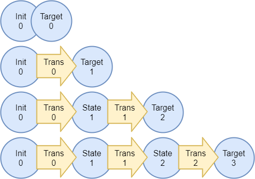
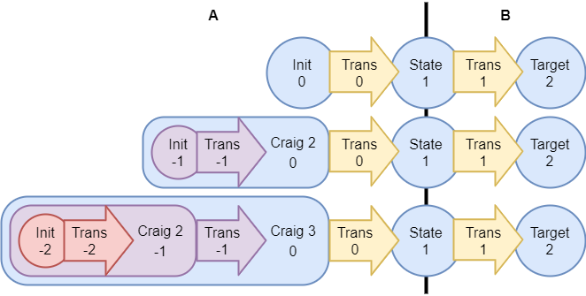

# BMC

## Native BMC format

The native format used by NCIP encodes a reachability problem that consists of three CNFs parts:

- `Init`: A CNF encoding of the allowed initial states
- `Trans`: A CNF encoding of the (non-total) transition relation that defines the state transition from one state to the next
- `Target`: A CNF encoding of the allowed target states

## Bounded Model Checking (BMC)

To prove the reachability of a target state the prover unrolls the given BMC problem progressively.
In each step of the unrolling (`Depth k`), the prover checks if a path with length `k` from one of the initial states to a target state exists.

- `Depth 0` := `Init 0` ∧ `Target 0` ≟ ⊤
- `Depth 1` := `Init 0` ∧ `Trans 0` ∧ `Target 1` ≟ ⊤
- `Depth 2` := `Init 0` ∧ `Trans 0` ∧ `Trans 1` ∧ `Target 2` ≟ ⊤
- `Depth 3` := `Init 0` ∧ `Trans 0` ∧ `Trans 1` ∧ `Trans 2` ∧ `Target 3` ≟ ⊤
- `Depth 4` := ...

Below is a visualization of the tested paths up to depth `k = 3`:



After maximum depth `n` has been reached and no path was found the search is aborted.
No conclusion about reachability can be made for paths beyond length `n`.

Therefore, the BMC prover returns one of the following results:

- `SAT`: A path with length ≤ `n` from one of the initial states to a target state has been found.
- `DEPTH LIMIT`: No path with length ≤ `n` has been found that leads to the target state.

## Unbounded Model Checking with Craig interpolation

### Craig Interpolation

Through the use of Craig interpolation the BMC approach can be extended to unbounded model checking.
For this, the problem is split into two parts `A` and `B`:

- `A` := `Init 0` ∧ `Trans 0`
- `B` := `Trans 1` ∧ `Trans 2` ∧ ... ∧  `Target k`

At depth `k` the problem is unchanged as follows:

- `Depth k` := `A` ∧ `B` ≟ ⊤

However, when the check at depth `k` returns that no path with length `k` was found, then a Craig interpolant is constructed.
The Craig interpolant `C` over-approximates the `A` part of the formula and has the following properties:

- `A ⇒ C`: Meaning, `A` implies the Craig interpolant `C`
- `C ⇒ ¬B`: Meaning, the Craig interpolant `C` implies `¬B`
- `C` only contains variables shared between `A` and `B` (global variables `G`)

Intuitively, the Craig interpolant `C` captures the relation that the `A` and `B` part can not be satisfied together through transitivity:

- (`A` ⇒ `C`) ∧ (`C` ⇒ `¬B`): Both parts, `A` and `B`, can not be ⊤ together
- `C` uses only variables shared between `A` and `B` to express this
- `C` is an over-approximated image of `A`

### Over-Approximation with Craig Interpolation

Now, assume at depth `k` a Craig interpolant `C k` is constructed.
In the following check at depth `k+1` the Craig interpolant together with `Init 0` is used instead of just `Init 0`.
Intuitively, the set if initial states is extended with the states defined by the Craig interpolant.

The Craig interpolant `C k` is an over-approximation of the `A` part of the  previous check (`C k = ⌈A⌉ = ⌈Init 0 ∧ Trans 0⌉`).
The variables contained in the Craig interpolant are the ones shared between `A` and `B`.
Therefore, they are at the ones shared between `Trans 0` and `Trans 1`, which we call `State 1`.
To add the variables to the initial state they are shifted by `-1` to create `C k' := shift(C k, -1)`.
This results in variables from `C k'` to be in the realm of `State 0` instead the interface between `A` and `B` (`State 1`).

Note, that the unrolling depth is kept at `k`, hence the target states are `Target k`.
The Craig interpolant contains an over-approximation of states that are reachable from the initial states in one step (`C k = ⌈A⌉ = ⌈Init 0 ∧ Trans 0⌉`).
Therefore, the check at `Depth k+1` has the same unrolling depth `k` (`B` is the same as before), but checks for paths length ≤ `k+1` via the Craig interpolant:

- `A` := (`Init 0` ∨ `C k'`) ∧ `Trans 0`
- `B` := `Trans 1` ∧ `Trans 2` ∧ ... ∧  `Target k`
- `Depth k+1` := `A` ∧ `B` ≟ ⊤

There are two outcomes:

1) The `Depth k+1` check returns a path with length ≤ `k+1`.
`Depth k+1` has to be unrolled fully to length `k+1` and checked again without Craig interpolation (plain BMC check).
Remember, the Craig interpolant over-approximated the previous `A` part (`C k' = shift(⌈Init 0 ∧ Trans 0⌉, -1)`) and therefore can include states that are not reachable from the initial states.
2) The `Depth k+1` check finds no path.
Then the new Craig interpolant `C k+1` is constructed, and `C k+1'` added to the initial states like `C k'` before.
The Craig interpolant `C k+1` is now an over-approximation of `A` that includes the previous Craig interpolant (`C k+1 = ⌈A⌉ = ⌈(Init 0 ∨ C k') ∧ Trans 0⌉`).
Now, at `Depth k+2` we check for paths with length `k+2`, without substantially increasing the complexity of the check itself again.
The initial state is extended with Craig interpolants until outcome 1 ocurrs or a fixed-point is found (see next chapter).

Below is a visualization of the checking with process:



### Fixed-Point Check

Each consecutive check that results in outcome 2 (no path is found and a Craig interpolant is constructed), will result in an over-approximation of `A`.
Let's assume there have been `m`-times where consecutively outcome 2 was the result of the checks.
Each time the Craig interpolant is built, the single transition step (`Trans 0`) is included in the over-approximation.
Th results in the Craig interpolant `C m` to be an over-approximation of all reachable states in `m` steps, starting from the initial states.
Hence, the set of states represented by the Craig interpolant grows with each iteration.

This results eventually in either outcome 1, where a path with length `k+m` is found where subsequently `Depth k+m` is re-evaluated without Craig interpolation, or outcome 2 where the addition of the Craig interpolant stops changing the represented reachable states.
Outcome 2 is called a fixed-point and can be formulated as follows:

- `A k+m-1` := (`Init 0` ∨ `C k'` ∨ `C k+1'` ∨ ... ∨ `C k+m-1'`)
- `A k+m` := (`Init 0` ∨ `C k'` ∨ `C k+1'` ∨ ... ∨ `C k+m-1'` ∨ `C k+m'`)
- `A k+m-1` ⇒ `A k+m` means a fixed-point has been reached

In outcome 2, a fixed-point has been reached and another over-approximation result in the same Craig interpolant again.
Since no path from the over-approximation to one of the target states can be found and no more new states are reachable from the current states, it can be concluded that none of the target states can ever be reached.
Hence, no path with any length exists to one of the target states as all reachable states have already been included in the set of starting states.
Using the Craig interpolants a certificate can be constructed as a proof of this unreachability.

Concluding, the BMC prover returns now either of the results:

- `SAT`: A path with length `n` from one of the initial states to a target state has been found.
- `UNSAT`: A fixed-point has been reached and no path with any length to a target state exists.
- `DEPTH LIMIT`: No path with length ≤ `k` has been found that leads to a target state.

### Completeness

To guarantee the procedure with over-approximation is complete, the BMC formula is adjusted.
Instead of checking if a path with exactly length `k` exists, we check for all paths with length ≤ `k` at the same time.
This corrects for states that are not reachable from the initial states which are contained in the over-approximation, but these states forming a path with length < `k` to one of the target states.
By including all the possible target states for paths ≤ `k`, the procedue is complete.
This is formalized as follows:

- `Targets` := `Target 1` ∨ `Target 2` ∨ ... ∨ `Target k`
- `A` := (`Init 0` ∨ `C k'` ∨ `C k+1'` ∨ ... ∨ `C k+m-1'`) ∧ `Trans 0`
- `B` := `Targets` ∧ `Trans 1` ∧ `Trans 2` ∧ ... ∧ `Trans k-1`

### Non-Total transition relations

Support for non-total transition relations is provided by adjusting the BMC formula once again.
Assuming non-total transition relations, the conjunction of all transition relations could be ⊥ due to a transition `Trans m` for path length `m`.
However, a path shorter than length `m` from an over-approximated starting state to a target state (e.g. `Target m-1`) could exist.

Therefore, to allow for non-total transition relations, each transition step has to be encoded in combination with unreachability of previous target states.
In words, the new encoding specifies for each length: "either reach `Target m`, or do a transition step `Trans m` and check reachability of longer paths".
This can be formalized as follows:

- `Steps` := `Target 1` ∨ (`Trans 1` ∧ (`Target 2` ∨ (`Trans 2` ∧ (... ∧ `Target k`))))
- `Targets` := `Target 1` ∨ `Target 2` ∨ ... ∨ `Target k`
- `A` := (`Init 0` ∨ `C k'` ∨ `C k+1'` ∨ ... ∨ `C k+m-1'`) ∧ `Trans 0`
- `B` := `Steps` ∧ `Targets`

Where `Steps` can be simplified to:

- `Step i` := (¬`Target 1` ∧ ... ∧ ¬`Target i`) ⇒ `Trans i`
- `Targets` := `Target 1` ∨ `Target 2` ∨ ... ∨ `Target k`
- `A` := (`Init 0` ∨ `C k'` ∨ `C k+1'` ∨ ... ∨ `C k+m-1'`) ∧ `Trans 0`
- `B` := `Targets` ∧ (⋀ `Step i` ∀ `i` ≤ `k`)

## BMC Certificates

Certificates encode the Craig interpolants that lead to a fixed-point.
The Craig interpolants are stored in an Aiger structure represented by the class `BmcCertificate`.
Each Craig interpolant is represented by a root edge that points into the Aiger structure.
The list of root edges (`C 0`, `C 1`, ..., `C n`) allows constructing a certificate for the target format.
Certificates encode the fixed-point as property that represents all reachable states from the `Init 0` states.
E.g.: `P = Init 0 ∨ C 0 ∨ C 1 ∨ ... ∨ C n` where `Init 0` is the initial state CNF and `C 0` to `C n` are the Craig interpolants.

The Aiger structure of `BmcCertificate` is stored as node list containing a mix of three node types:

- `AigConstant`: The constant value 1 (always edge with ID 1)
- `AigLiteral`: A literal from the native BMC format
- `AigAnd`: And AND-gate with the left and right edge IDs

Edges of the Aiger structure are stored in signed form and start with ID 1.

- Edge 1 = Node with index 0, positive (constant 1)
- Edge -1 = Node with index 0, negative (constant 0)
- Edge 2 = Node with index 1, positive
- Edge -2 = Node with index 1, negative
- Edge 3 = Node with index 1, positive

## BMC API

The format can be passed to the NCIP C++ API via the `BmcClauses`, `BmcLiteral` and `BmcProblem` classes.
For ease-of-use and simple handling of literals, the `-` (invert literal), `^` (xor literal with boolean) and `>>` (shift literal timeframe) operators are overloaded.
Below is an example for the usage of the NCIP C++ API, constructing the native format on-the-fly, combined with a prover portfolio approach to run two NCIP instances in parallel.

```cpp
#include <iostream>

#include <bmc-ncip.hpp>
#include <bmc-ncip-portfolio.hpp>

using namespace Ncip;

int main() {
  // Build the native BMC-Problem on-the-fly.
  auto latchLit { BmcLiteral::FromVariable(0) };
  BmcClauses initClauses { { -latchLit } };
  BmcClauses transClauses {
    {  latchLit, -latchLit >> 1 },
    { -latchLit,  latchLit >> 1 }
  };
  BmcClauses targetClauses { { latchLit } };

  BmcProblem bmcProblem {
    1, // number of variables
    initClauses,
    transClauses,
    targetClauses
  };

  // Build the NCIP configuration that holds the NCIP options.
  BmcConfiguration config { };
  config.SetMaximumDepth(10);

  // Build a portfolio with MiniCraig and CaDiCraig as backends.
  // Each prover in the portfolio has a separate problem and configuration.
  PortfolioBmcSolver solver {
    MiniCraigBmcSolver { bmcProblem, config },
    CadiCraigBmcSolver { bmcProblem, config }
  };
  auto result { solver.Solve() };
  switch (result.GetStatus()) {

  case BmcStatus::Sat:
    std::cout << "Sat" << std::endl;
    for (auto const& timeframe : result.GetModel().GetTimeframes()) {
      std::cout << "Model " << to_string(timeframe) << std::endl;
    }
    return 10;

  case BmcStatus::Unsat:
    std::cout << "Unsat" << std::endl;
    auto certificate { result.GetCertificate() };
    for (auto const& root : certificate.GetRoots()) {
      std::cout << "Cert Root " << root << std::endl;
    }
    for (auto const& node : certificate.GetNodes()) {
      struct Visitor {
        std::string operator(const BmcCertificate::AigConstant& node) {
          return "constant 1";
        }
        std::string operator(const BmcCertificate::AigLiteral& node) {
          return "literal " + to_string(node.literal);
        }
        std::string operator(const BmcCertificate::AigConstant& node) {
          return "and left=" + std::to_string(node.left)
            + " right=" + std::to_string(node.right);
        }
      };
      std::cout << "Cert Node " << std::visit(Visitor {}, node); << std::endl;
    }
    return 20;

  default:
    std::cout << "Limit Reached" << std::endl;
    return 30;

  }
}
```
